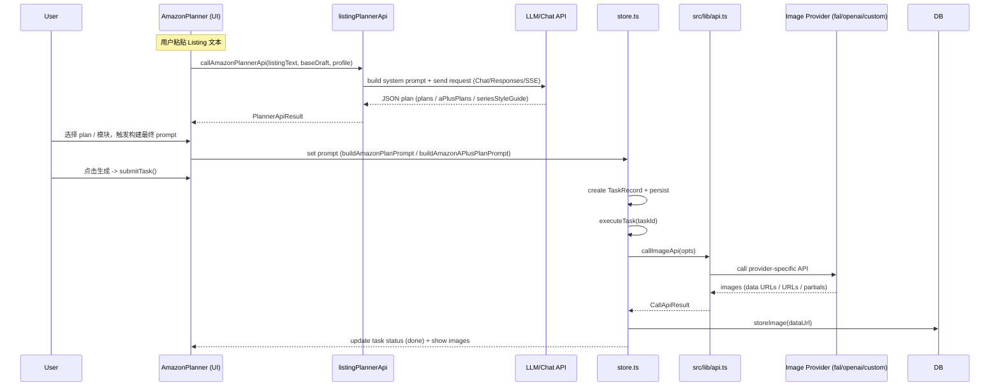
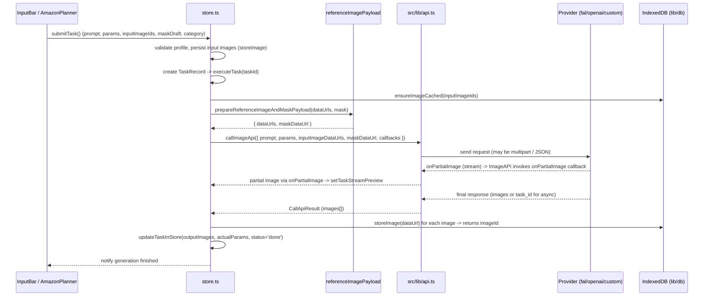

# Amazon Image Studio — Architecture Overview

This document summarizes the project layout, main modules, and the prompt/image generation flows.

1. 项目根目录结构
- **文件/目录**: top-level files and folders
  - CHANGELOG.md
  - README.md
  - package.json
  - tsconfig.json
  - vite.config.ts
  - postcss.config.js, tailwind.config.js
  - public/ (static assets)
  - deploy/ (deployment helpers)
  - docs/ (this file)
  - scripts/ (dev helpers/mock API)
  - src/ (source code)

2. `src` 目录结构
- 根文件
  - [src/main.tsx](src/main.tsx) — 页面入口
  - [src/App.tsx](src/App.tsx) — 根 React 组件，装配主要 UI
  - [src/index.css](src/index.css)
  - [src/store.ts](src/store.ts) — 全局状态与任务提交/执行逻辑

- 主要子目录
  - [src/components/](src/components) — React UI 组件（AmazonPlanner, InputBar, TaskGrid, MaskEditorModal 等）
  - [src/lib/](src/lib) — 业务逻辑与集成（planner、prompt、API 适配、样式模板、图像 API）
  - [src/hooks/](src/hooks) — 自定义 Hook

3. 项目技术栈
- **前端框架**: React (v18+/v19) + TypeScript
- **打包/开发**: Vite
- **样式**: Tailwind CSS + PostCSS
- **状态管理**: zustand
- **测试**: Vitest
- **图片/LLM 供应商集成**: fal.ai client (`@fal-ai/client`), OpenRouter/OpenAI compatible HTTP paths via code in `src/lib/openaiCompatibleImageApi.ts` 和 `src/lib/falAiImageApi.ts`
- **持久化**: IndexedDB wrappers in `src/lib/db.ts`

4. 页面入口文件
- Entry: [src/main.tsx](src/main.tsx) — 调用 `installMobileViewportGuards()` 然后渲染 `<App />`。
- App: [src/App.tsx](src/App.tsx) — 初始化 store、读取 URL 设置并挂载核心组件（`Header`, `AmazonPlanner`, `TaskGrid`, `InputBar` 等）。

5. 主要业务模块
- **Amazon 策划 (Planner) UI**: [src/components/AmazonPlanner.tsx](src/components/AmazonPlanner.tsx)
- **Prompt 构建**: [src/lib/amazonPrompt.ts](src/lib/amazonPrompt.ts) 和 [src/lib/listingPlanner.ts](src/lib/listingPlanner.ts)
- **AI 策划 API 调用与解析**: [src/lib/listingPlannerApi.ts](src/lib/listingPlannerApi.ts)
- **图片 API 适配层**: [src/lib/api.ts](src/lib/api.ts), [src/lib/openaiCompatibleImageApi.ts](src/lib/openaiCompatibleImageApi.ts), [src/lib/falAiImageApi.ts](src/lib/falAiImageApi.ts)
- **样式/风格管理**: [src/lib/stylePresets.ts](src/lib/stylePresets.ts), [src/lib/styleReferences.ts](src/lib/styleReferences.ts)
- **任务与状态管理**: [src/store.ts](src/store.ts)
- **持久化**: [src/lib/db.ts](src/lib/db.ts)

6. Listing Planner 相关文件
- Core logic and types: [src/lib/listingPlanner.ts](src/lib/listingPlanner.ts)
- Planner → API glue & response parsing: [src/lib/listingPlannerApi.ts](src/lib/listingPlannerApi.ts)
- Tests: [src/lib/listingPlanner.test.ts](src/lib/listingPlanner.test.ts)
- UI usage: [src/components/AmazonPlanner.tsx](src/components/AmazonPlanner.tsx) (调用 `callAmazonPlannerApi`、展示结果、选择 plan)

7. A+ Planner 相关文件
- A+ module specs, helpers and prompt builder: [src/lib/listingPlanner.ts](src/lib/listingPlanner.ts) (包含 A+ 模块规格、`buildAmazonAPlusPlanPrompt` 等)
- A+ planning API entry & schema validation: [src/lib/listingPlannerApi.ts](src/lib/listingPlannerApi.ts) (`createAPlusPlannerSchema`、`normalizeAPlusPlannerApiPayload`)
- A+ UI: 同样由 [src/components/AmazonPlanner.tsx](src/components/AmazonPlanner.tsx) 提供模块选择/生成与展示逻辑

8. Prompt 生成链路（从用户输入到最终 Prompt）
- 用户在 UI 中输入 / 选择（`AmazonPlanner`）→ 组件将构造 Draft（`AmazonPromptDraft`）。
- 单图 Prompt 构建: [src/lib/amazonPrompt.ts](src/lib/amazonPrompt.ts) 的 `buildAmazonPrompt`。
- 列表/整套策划 Prompt: [src/lib/listingPlanner.ts](src/lib/listingPlanner.ts) 中的 `buildAmazonPlanPrompt` / `buildAmazonAPlusPlanPrompt`（用于把单张 plan 或 A+ 模块组装成最终给 LLM 的英文 prompt，含 style reference、negative prompt、seriesStyleGuide 等）。
- 将要发送给策划 LLM 的指令与 schema 在: [src/lib/listingPlannerApi.ts](src/lib/listingPlannerApi.ts)（`buildPlannerInstructions`, `buildChatPlannerSystemPrompt`）。
- 策划结果（JSON）解析与规范化：`callAmazonPlannerApi` 会调用远端 Chat/Responses API，读取 SSE 或常规 JSON，并通过 `normalizeListingPlannerApiPayload` / `normalizeAPlusPlannerApiPayload` 标准化为内部对象。

9. 风格模板 (Style Presets) 相关文件
- 预设列表与加载：[src/lib/stylePresets.ts](src/lib/stylePresets.ts)
- 自定义风格参考、渲染与验证：[src/lib/styleReferences.ts](src/lib/styleReferences.ts)
- 预设图片资源: `public/style-presets/`（例: `clean-tech.png`, `natural-warm.png`, `premium-contrast.png`, `bright-retail.png`）
- 编辑器 UI: [src/components/StyleReferenceEditorModal.tsx](src/components/StyleReferenceEditorModal.tsx)

10. 图片生成调用链路（UI → API → 返回）
- 用户在 UI 点击生成 → `submitTask()` 在 [src/store.ts](src/store.ts) 被触发。
- `submitTask` 会构建任务记录并异步调用 `executeTask`（内部流程在 `store.ts` 中实现）。
- 任务发送到图像层: [src/lib/api.ts](src/lib/api.ts) 的 `callImageApi(opts)` → 根据 profile 调用：
  - fal.ai 集成: [src/lib/falAiImageApi.ts](src/lib/falAiImageApi.ts)（`callFalAiImageApi`）
  - OpenAI/OpenRouter/自定义兼容路径: [src/lib/openaiCompatibleImageApi.ts](src/lib/openaiCompatibleImageApi.ts)（`callOpenAICompatibleImageApi`），内部实现包括 `callImagesApi`、`callResponsesImageApi`、`callOpenRouterChatImageApi` 等
- 公共辅助与解析: [src/lib/imageApiShared.ts](src/lib/imageApiShared.ts)（payload 辅助、Base64 <-> dataURL、错误解析、大小校验等）
- API 响应解析后，`store` 会在本地持久化图片（`src/lib/db.ts`），并更新任务状态与 UI。

更多细节/入口文件索引（快速跳转）
- Entry: [src/main.tsx](src/main.tsx)
- Root App: [src/App.tsx](src/App.tsx)
- Planner UI: [src/components/AmazonPlanner.tsx](src/components/AmazonPlanner.tsx)
- Prompt builders: [src/lib/amazonPrompt.ts](src/lib/amazonPrompt.ts), [src/lib/listingPlanner.ts](src/lib/listingPlanner.ts)
- Planner API: [src/lib/listingPlannerApi.ts](src/lib/listingPlannerApi.ts)
- Image API surface: [src/lib/api.ts](src/lib/api.ts), [src/lib/openaiCompatibleImageApi.ts](src/lib/openaiCompatibleImageApi.ts), [src/lib/falAiImageApi.ts](src/lib/falAiImageApi.ts)
- Style presets & references: [src/lib/stylePresets.ts](src/lib/stylePresets.ts), [src/lib/styleReferences.ts](src/lib/styleReferences.ts)

Generated from repository scan. If you want, I can:
**组件职责与数据流**

- **组件职责（简要）**
  - `src/components/AmazonPlanner.tsx`: 主策划界面，编辑 `AmazonPromptDraft`、调用 `callAmazonPlannerApi` 获取 image/A+ 计划，选择风格引用并构造最终 prompt。
  - `src/components/InputBar.tsx`: 用户输入 prompt、上传参考图、触发提交（调用 `submitTask`）。
  - `src/components/TaskGrid.tsx` / `src/components/TaskCard.tsx`: 列出任务、展示状态与输出图，提供重试/复用/编辑入口。
  - `src/components/MaskEditorModal.tsx`: 编辑遮罩并将 mask 数据注入 `store`（maskDraft）。
  - `src/components/StyleReferenceEditorModal.tsx`: 管理风格预设与自定义风格，调用 `stylePresets`/`styleReferences` 的存取接口。
  - `src/components/Lightbox.tsx` / `DetailModal.tsx`: 展示生成图、导出、二次编辑入口（会与 `store` 中的选择 task/image id 交互）。

- **Store（`src/store.ts`）关键方法与调用链**
  - `submitTask()` — 用户点击生成时触发（通常由 `InputBar` 或 `AmazonPlanner` 调用）。职责：验证 API 配置、校验 prompt、处理 mask、附加隐藏风格参考（若有）、持久化输入图片、创建 TaskRecord 并调用 `executeTask(taskId)`。
  - `executeTask(taskId)` — 执行图片生成的核心流程：
    1. 从任务记录读取 `prompt`, `params`, `inputImageIds`, `maskImageId`。
    2. 读取/确保输入图片的 data URLs（`ensureImageCached` / `getImage`）。
    3. 调用 `prepareReferenceImageAndMaskPayload`（`src/lib/referenceImagePayload.ts`）规范参考图与遮罩。
    4. 调用 `callImageApi(opts)`（`src/lib/api.ts`）——路由到 `callFalAiImageApi` 或 `callOpenAICompatibleImageApi`。
    5. 在回放流/中间图时通过 `setTaskStreamPreview` 更新预览；最终成功时将每张返回的 base64 数据存到 IndexedDB（`storeImage`），并调用 `updateTaskInStore` 更新任务状态为 `done`。
    6. 在失败场景下根据错误类型设置任务为 `error` 并可能调度重试或恢复（fal/custom recovery）。
  - `updateTaskInStore(taskId, patch)` — 原子更新内存任务列表并持久化到 DB（`putTask`），同时触发 UI 通知与支持提示逻辑。
  - `retryTask(task)` — 基于现有任务创建新任务并再次调用 `executeTask`。
  - `reuseConfig(task)` / `editOutputs(task)` — 将已有任务的数据恢复到输入草稿（prompt、inputImages、maskDraft、params），以便用户做二次编辑或复用配置，通常由 `TaskCard` / `TaskGrid` 的按钮触发。

- **Planner（文本策划）→ 生成 的数据流**
  - `AmazonPlanner` 触发 `callAmazonPlannerApi({ listingText, baseDraft, profile, ... })`（`src/lib/listingPlannerApi.ts`）
  - Planner API 返回 JSON 且被 `callAmazonPlannerApi` 标准化为 `PlannerApiResult`（含 `plans` / `aPlusPlans` 与 `seriesStyleGuide`）。
  - 用户在 UI 选择某个 plan 或 A+ 模块，`AmazonPlanner` 使用 `buildAmazonPlanPrompt` / `buildAmazonAPlusPlanPrompt`（`src/lib/listingPlanner.ts`）生成最终英文 Prompt，写入 `store.prompt`。
  - 用户点击生成（`submitTask`）后走上述图片生成链路。

---
Progress: 已把“组件职责与 store 数据流”追加到 `docs/ARCHITECTURE.md`。
下一步：如果需要，我可把上面关键调用链绘制为 Mermaid 时序图并追加到文档。
**调用链时序图 (Mermaid)**

以下两张时序图描述关键交互：1) 策划（Planner）到 Prompt 到 生成 的高层流程；2) 图片生成的详细执行流程（含参考图/遮罩、流式中间图）。

Planner → Prompt → Generate（高层）

图片生成：详细流程（含参考图、遮罩、流式中间图）

---
已将 Mermaid 时序图追加到文档并在任务列表中标记为完成。需要调整图中参与者标签或添加更详细的分支（例如 DeepSeek 特殊处理、OpenRouter modality retry）吗？
