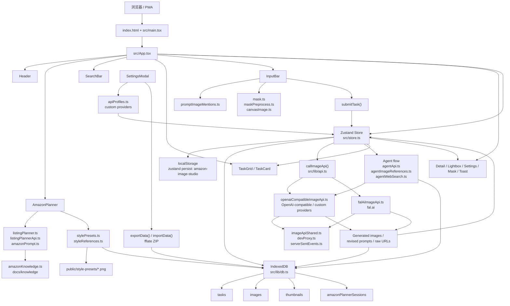

# Amazon Image Studio 项目地图

生成日期：2026-06-15

## 1. 根目录结构

```text
.
├── .github/
│   └── workflows/
├── deploy/
│   ├── Dockerfile
│   ├── inject-api-url.sh
│   ├── migrate-api-env.envsh
│   └── nginx.conf
├── docs/
│   ├── ARCHITECTURE.md
│   ├── custom-provider-llm-prompt.md
│   ├── images/
│   ├── knowledge/
│   │   ├── 亚马逊图片规范与附图策划逻辑.md
│   │   └── 亚马逊美国站A加尺寸图.md
│   └── mock-image-api.md
├── public/
│   ├── manifest.webmanifest
│   ├── pwa-icon.png
│   ├── pwa-icon.svg
│   ├── style-presets/
│   │   ├── bright-retail.png
│   │   ├── clean-tech.png
│   │   ├── natural-warm.png
│   │   └── premium-contrast.png
│   └── sw.js
├── scripts/
│   ├── ensure-dev-dependencies.ps1
│   └── mock-image-api.mjs
├── src/
├── CHANGELOG.md
├── LICENSE
├── README.md
├── dev-proxy.config.example.json
├── index.html
├── package-lock.json
├── package.json
├── postcss.config.js
├── start-amazon-image-studio.bat
├── stop-amazon-image-studio.bat
├── tailwind.config.js
├── tsconfig.json
├── vercel.json
├── vite.config.ts
└── wrangler.jsonc
```

说明：`node_modules/` 与 `.git/` 未列入上面的项目地图。

## 2. src 目录结构

```text
src/
├── App.tsx
├── main.tsx
├── index.css
├── store.ts
├── store.test.ts
├── types.ts
├── vite-env.d.ts
├── components/
│   ├── AgentWorkspace.tsx
│   ├── AmazonPlanner.tsx
│   ├── Checkbox.tsx
│   ├── ConfirmDialog.tsx
│   ├── DetailModal.tsx
│   ├── Header.tsx
│   ├── HelpModal.tsx
│   ├── HistoryModal.tsx
│   ├── ImageContextMenu.tsx
│   ├── InputBar.tsx
│   ├── Lightbox.tsx
│   ├── MarkdownRenderer.tsx
│   ├── MaskEditorModal.tsx
│   ├── SearchBar.tsx
│   ├── Select.tsx
│   ├── SettingsModal.tsx
│   ├── SizePickerModal.tsx
│   ├── StyleReferenceEditorModal.test.tsx
│   ├── StyleReferenceEditorModal.tsx
│   ├── SupportPromptModal.tsx
│   ├── TaskCard.tsx
│   ├── TaskGrid.tsx
│   ├── Toast.tsx
│   ├── ViewportTooltip.tsx
│   └── icons.tsx
├── hooks/
│   ├── useCloseOnEscape.ts
│   ├── useDockerApiUrlMigrationNotice.ts
│   ├── useDragSelect.ts
│   ├── useHintTooltip.ts
│   ├── usePreventBackgroundScroll.ts
│   ├── useTooltip.ts
│   └── useVersionCheck.ts
└── lib/
    ├── agentApi.ts
    ├── agentImageReferences.ts
    ├── agentWebSearch.ts
    ├── amazonKnowledge.ts
    ├── amazonPrompt.ts
    ├── api.ts
    ├── apiProfiles.ts
    ├── canvasImage.ts
    ├── clickSuppression.ts
    ├── clipboard.ts
    ├── db.ts
    ├── devProxy.ts
    ├── domRect.ts
    ├── downloadImages.ts
    ├── dropdown.ts
    ├── falAiImageApi.ts
    ├── imageApiShared.ts
    ├── listingPlanner.ts
    ├── listingPlannerApi.ts
    ├── mask.ts
    ├── maskPreprocess.ts
    ├── openaiCompatibleImageApi.ts
    ├── paramCompatibility.ts
    ├── paramDisplay.tsx
    ├── promptImageMentions.ts
    ├── referenceImagePayload.ts
    ├── runtimeEnv.ts
    ├── serverSentEvents.ts
    ├── size.ts
    ├── stylePresets.ts
    ├── styleReferences.ts
    ├── taskHistory.ts
    ├── taskPromptDisplay.ts
    ├── tooltipDismiss.ts
    ├── urlSettings.ts
    ├── viewport.ts
    └── viewportTransform.ts
```

`src/lib/` 下还有同名或相关的 `*.test.ts` 测试文件，用于覆盖 API、参数兼容、遮罩、规划器、风格、历史、引用图等逻辑。

## 3. 技术栈

- 应用框架：Vite 6 + React 19 + React DOM 19。
- 语言与构建：TypeScript 5，ES Module，`tsc -b && vite build`。
- 样式：Tailwind CSS 3、PostCSS、Autoprefixer，暗色模式使用 `media`。
- 状态管理：Zustand 5 + `zustand/middleware/persist`。
- Markdown/流式内容：`react-markdown`、`remark-gfm`、`streamdown`。
- 图片 API：OpenAI-compatible Images/Responses/Chat 路径、自定义 HTTP 图片服务商、fal.ai SDK。
- 数据打包：`fflate` 用于导入导出 ZIP。
- 测试：Vitest。
- 部署/运行：Vite preview、Cloudflare Wrangler、Vercel 配置、Docker + Nginx。
- PWA：`public/manifest.webmanifest` 与 `public/sw.js`。

## 4. 页面入口文件

- `index.html`：Vite HTML 入口，提供 `#root` 容器。
- `src/main.tsx`：React 挂载入口；安装移动端 viewport guard；生产环境注册 Service Worker，开发环境注销已有 Service Worker。
- `src/App.tsx`：应用壳入口；初始化设置、调用 `initStore()`，并组合主页面组件：`Header`、`AmazonPlanner`、`SearchBar`、`TaskGrid`、`InputBar`、各种 Modal/Toast/ContextMenu。
- `src/index.css`：全局样式与 Tailwind 注入点。

## 5. 状态管理方案

- 核心 store：`src/store.ts`。
- 状态库：Zustand `create<AppState>()`。
- 持久化：Zustand `persist`，本地 key 为 `amazon-image-studio`。
- 持久化字段由 `getPersistedState()` 控制，主要包括：
  - `settings`
  - `params`
  - 可选的 gallery 输入草稿
  - Agent 对话、Agent 输入草稿和 Agent 面板状态
  - Codex CLI 提示关闭状态
  - 支持提示弹窗状态
- 恢复逻辑：`mergePersistedState()` 对持久化数据做规范化，并重建 gallery/agent 输入草稿。
- 大数据不直接存在 Zustand localStorage：任务、图片、缩略图、Amazon 策划历史放在 IndexedDB，由 `src/lib/db.ts` 管理。
- 内存缓存：`src/store.ts` 内维护 `imageCache` 和 `thumbnailCache`，减少 4K data URL 常驻和重复解码。
- 主要状态域：
  - 应用模式：`gallery` / `agent`
  - 设置：API profiles、自定义服务商、Agent、风格引用等
  - 输入：prompt、参考图、遮罩草稿
  - 参数：尺寸、质量、格式、压缩、审核、数量
  - 任务列表：running/done/error、流式预览、历史筛选
  - Agent：对话、轮次、消息、工具调用输出
  - UI：详情、灯箱、设置、确认弹窗、Toast、选择状态

## 6. Prompt 生成相关文件

- `src/lib/amazonPrompt.ts`
  - 定义 Amazon 图片类型预设：主图、场景图、细节图、比例图、套装图、步骤图。
  - `buildAmazonPrompt()` 生成 Amazon 合规图片 prompt。
  - `getAmazonComplianceChecks()` 生成 UI 检查项。
- `src/lib/listingPlanner.ts`
  - 定义 Listing 与 A+ 图片位、模块尺寸、规划结构。
  - 组合最终图片 prompt、negative prompt、系列风格指南、风格参考规则和密度规则。
- `src/lib/listingPlannerApi.ts`
  - 调用 Chat Completions 或 Responses API 生成 Listing/A+ 策划 JSON。
  - 包含 schema、SSE 解析、知识材料拼接和模型响应解析。
- `src/lib/amazonKnowledge.ts`
  - 格式化 Amazon Listing 和 A+ 参考知识材料，供 AI 策划 prompt 使用。
- `src/lib/promptImageMentions.ts`
  - 处理 prompt 中 `@图`、选中图、Agent 输出图等引用标记。
  - 在提交前把 UI mention 映射为 API 可理解的图片引用关系。
- `src/lib/taskPromptDisplay.ts`
  - 任务 prompt 展示辅助逻辑，尤其用于 Agent 任务的 pending/展示态。
- `docs/custom-provider-llm-prompt.md`
  - 设置页“复制给 LLM”使用的自定义图片服务商配置生成提示词。

## 7. 风格模板相关文件

- `src/lib/stylePresets.ts`
  - 内置风格模板元数据：`clean-tech`、`natural-warm`、`premium-contrast`、`bright-retail`。
  - 读取 `public/style-presets/*.png`，并通过 `storeImage(..., 'preset')` 存入 IndexedDB。
- `public/style-presets/`
  - 内置风格参考 PNG 资源目录。
- `src/lib/styleReferences.ts`
  - 自定义风格参考图的数据清洗、描述生成、Canvas 渲染与存储。
  - `renderStyleReferenceDataUrl()` 生成 1024x1024 风格参考板。
  - `ensureCustomStyleReferenceImageStored()` 存储来源为 `style-custom` 的风格图。
- `src/components/StyleReferenceEditorModal.tsx`
  - 自定义风格参考编辑 UI。
- `src/components/AmazonPlanner.tsx`
  - 风格模板选择、风格参考图挂载、策划会话里的风格状态管理。
- `src/types.ts`
  - `StyleReferenceEditState`、`CustomStyleReference`、`AmazonStyleDensityMode`、策划会话里的风格字段。

## 8. 图片生成相关文件

- `src/store.ts`
  - `submitTask()` 创建任务、保存输入图/遮罩、追加隐藏风格参考图、规范化参数、写入 IndexedDB，然后异步执行生成。
  - Agent 图片生成、批量工具调用、任务重试、复用配置、导入导出也集中在这里。
- `src/lib/api.ts`
  - 图片生成统一入口 `callImageApi()`。
  - 根据当前 profile 路由到 fal.ai 或 OpenAI-compatible/custom provider。
- `src/lib/openaiCompatibleImageApi.ts`
  - OpenAI-compatible Images API、Responses API、Chat/OpenRouter 风格路径、自定义 HTTP 服务商、同步/异步轮询、SSE 图片流处理。
- `src/lib/falAiImageApi.ts`
  - fal.ai 图片生成和编辑、队列恢复、结果解析。
- `src/lib/imageApiShared.ts`
  - 图片 URL/base64/data URL 解析、CORS 获取、尺寸/体积校验、参数合并、错误信息处理等公共逻辑。
- `src/lib/agentApi.ts`
  - Agent Responses 调用、图片工具调用和批量单图生成参数解析。
- `src/lib/referenceImagePayload.ts`
  - 参考图和遮罩 payload 准备，供普通生成、编辑和策划使用。
- `src/lib/agentImageReferences.ts`
  - Agent 轮次中的输入/输出图片引用替换和收集。
- `src/lib/canvasImage.ts`
  - 图片/遮罩 Canvas 处理、格式转换、遮罩校验辅助。
- `src/lib/mask.ts`、`src/lib/maskPreprocess.ts`
  - 遮罩图排序、预处理、主图替换等编辑前处理。
- `src/components/InputBar.tsx`
  - 用户 prompt、参考图上传/拖拽、参数选择、普通提交和 Agent 提交入口。
- `src/components/MaskEditorModal.tsx`
  - 遮罩编辑 UI，保存遮罩图片。
- `src/components/TaskGrid.tsx`、`src/components/TaskCard.tsx`、`src/components/DetailModal.tsx`、`src/components/Lightbox.tsx`
  - 生成结果展示、详情、重试、编辑、查看大图。
- `scripts/mock-image-api.mjs` 与 `docs/mock-image-api.md`
  - 本地 mock 图片 API，用于验证自定义服务商、URL/CORS/base64 等场景。

## 9. 本地存储相关文件

- `src/lib/db.ts`
  - IndexedDB 数据库名：`amazon-image-studio`。
  - 当前版本：`DB_VERSION = 3`。
  - Object stores：
    - `tasks`：任务记录。
    - `images`：原图 data URL，按 SHA-256 去重。
    - `thumbnails`：缩略图 data URL，当前 `thumbnailVersion = 2`。
    - `amazonPlannerSessions`：Amazon Listing/A+ 策划历史。
  - 主要能力：任务 CRUD、图片/缩略图 CRUD、图片 hash 去重、缩略图生成、清空数据。
- `src/store.ts`
  - Zustand persist 使用浏览器 localStorage，key 为 `amazon-image-studio`。
  - 同时提供 `exportData()`、`importData()`、`clearData()`，支持 ZIP 导入导出和清空。
  - 管理内存级图片/缩略图 LRU 缓存。
- `src/components/SettingsModal.tsx`
  - 设置、API profiles、自定义服务商、导入导出、清空数据 UI。
  - 另有 `COPY_IMPORT_URL_OPTIONS_STORAGE_KEY` 相关 localStorage，用于记住复制导入 URL 选项。
- `src/lib/urlSettings.ts`
  - 从 URL query 导入设置，并在应用启动后清理相关 query。
- `src/lib/runtimeEnv.ts`
  - 读取运行时环境变量，用于默认 API 地址、代理可用性等。
- `public/sw.js`
  - PWA Service Worker 缓存静态资源。

## 整体架构图



